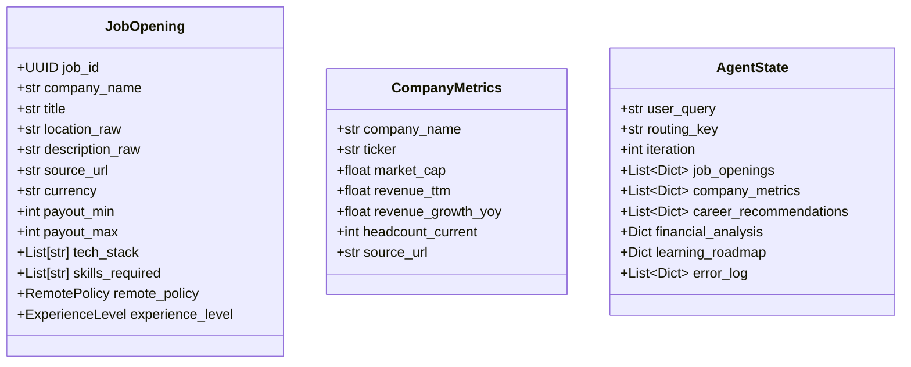

# Disha Architecture — Current Implementation

---

## 1. System Overview

Disha is a LangGraph-based multi-agent orchestration platform. It uses a **Supervisor-Specialist** pattern where a routing agent determines the execution path through deterministic specialist agents. The system is designed for India's AI/ML job market with localization for INR/LPA compensation, Indian city filtering, and private-company financial metrics.

---

## 2. Graph Structure

### Nodes

| Node | File | Purpose |
|------|------|---------|
| `supervisor` | `agents/supervisor_agent.py:126` | Intent analysis, dynamic delegation, iteration guard |
| `scraper` | `agents/scraper_agent.py:283` | Data acquisition: RSS feeds, Playwright scraping, LLM job extraction |
| `financial_analyst` | `agents/financial_agent.py:38` | India-first private-market scoring |
| `career_strategy` | `agents/career_agent.py:147` | Skill-gap + compensation matching |
| `learning_companion` | `agents/learning_agent.py:196` | Gap analysis, Gemini-generated ArXiv roadmap |
| `guardrail` | `agents/supervisor_agent.py:90` | Domain/tech/visa exclusion pre-synthesis |
| `synthesize` | `main.py:93` | Aggregation of all analyses into final answer |
| `error_recovery` | `main.py:222` | Fallback pipeline when primary agents fail |

### Edges

```
supervisor ──conditional──→ scraper
supervisor ──conditional──→ financial_analyst
supervisor ──conditional──→ career_strategy
supervisor ──conditional──→ learning_companion
supervisor ──conditional──→ error_recovery
supervisor ──conditional──→ guardrail (via "synthesize" key)
supervisor ──conditional──→ END

scraper ──→ supervisor          (all agents return to supervisor)
financial_analyst ──→ supervisor
career_strategy ──→ supervisor
learning_companion ──→ supervisor
error_recovery ──→ supervisor

guardrail ──→ synthesize
synthesize ──→ supervisor        (supervisor makes final END decision)
```

### Routing Logic

Defined in `main.py:51` (`should_continue`):

```python
def should_continue(state: AgentState) -> Literal[...]:
    # Hard stop at max_iterations (default 6)
    # Route based on routing_key
    # Valid routes: scraper, financial_analyst, career_strategy,
    #               learning_companion, error_recovery, synthesize, end
```

The routing is purely deterministic — a lookup table with an iteration guard. No LLM is used for routing decisions.

---

## 3. Key Architectural Patterns

### 3.1 State Management

All agents share a single `AgentState` TypedDict (`schemas.py:296`). Key fields:

- `job_openings: List[Dict[str, Any]]` — Serialized `JobOpening.model_dump()` results
- `company_metrics: List[Dict[str, Any]]` — Serialized `CompanyMetrics.model_dump()` results
- `career_recommendations: List[Dict[str, Any]]` — Career agent output
- `financial_analysis: Dict[str, Any]` — Financial agent output
- `learning_roadmap: Dict[str, Any]` — Learning agent output
- `routing_key: Literal[...]` — Next node to execute
- `iteration: int` — Current iteration count (supervisor increments)

All fields are optional (`total=False`), allowing incremental construction across nodes.

### 3.2 Tool Registration

Tools are defined using the `@tool` decorator from `langchain_core.tools`. Each tool module maintains:
- A list of tools (`SCRAPER_TOOLS`, `CAREER_TOOLS`)
- A registry map (`TOOL_MAP`, `CAREER_TOOL_MAP`)
- Accessor functions (`get_tool()`, `list_tools()`)

**Current limitation:** The registries are decorative — agents call tools by name directly rather than querying the registry. The registries are never used for runtime tool selection.

### 3.3 Error Recovery

The graph includes an `error_recovery` node that implements a fallback pipeline:

```
Failed Agent → error_recovery
  → scraper failure → BeautifulSoup fallback → retry scraper
  → financial failure → heuristic scoring → skip to career
  → career failure → keyword matching → skip to learning
  → learning failure → skip to synthesize
```

**Critical issue:** This path is never activated. No agent writes to `state["error_log"]`, so `error_recovery` never fires.

---

## 4. Data Model Relationships

### Core Models



- `JobOpening` → serialized to dict → stored in `AgentState.job_openings`
- `CompanyMetrics` → serialized to dict → stored in `AgentState.company_metrics`
- Career Agent reads `job_openings[]` → produces `career_recommendations[]`
- Financial Agent reads `company_metrics[]` → produces `financial_analysis{}`
- Learning Agent reads `career_recommendations[]` → produces `learning_roadmap{}`

---

## 5. Current Scraping Architecture

```
node_scraper(state) {
    [BBC RSS Feed] → mock CompanyMetrics for "BBC Business"
    [Playwright] → scrape greenhouse.io/openai → raw HTML → markdown
    [Gemini] → structured_llm.invoke(markdown) → list[JobOpening]
    [filter_jobs] → exclude HFT, Rust, C++, firmware, embedded
    → state["job_openings"] += filtered jobs
}
```

**Problems:**
1. BBC news RSS is not job data — it generates a mock CompanyMetrics entry with no real value
2. Only one URL is scraped (hardcoded OpenAI career page)
3. Gemini extraction is slow, costly, and non-deterministic
4. No error propagation — exceptions are logged and swallowed
5. The scraper has no awareness of the user query (scrapes the same URL regardless of query)

---

## 6. Current Career Matching Architecture

```
node_career_strategy(state) {
    load user_profile.yaml
    for each job in state["job_openings"]:
        if excluded_keywords match → skip
        if location doesn't match → skip
        calculate_skill_match() → match_pct, matched, missing
        calculate_comp_fit() → comp_fit, meets_min
        calculate_experience_fit() → exp_fit
        calculate_overall_score() → score (weighted formula)
        → ranked recommendation
    → state["career_recommendations"]
}
```

**Strengths:** Deterministic, transparent, all weights are explicit.
**Weaknesses:** Depends entirely on data quality from the scraper. If `tech_stack` or `skills_required` are empty, skill match is 0%.

---

## 7. Dependencies

From `requirements.txt`:

| Category | Packages |
|----------|----------|
| Web & API | fastapi, uvicorn |
| Database | sqlalchemy, asyncpg, pgvector |
| Data Processing | numpy, feedparser, pyyaml, pydantic, PyPDF2, beautifulsoup4, markdownify |
| Scraping | playwright |
| LLM & Orchestration | langchain-core, langchain-google-genai, langgraph |
| Utilities | python-dotenv |
